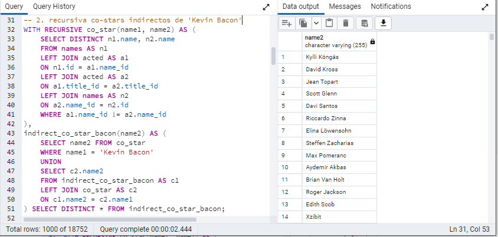

```{r setup, include=FALSE}
knitr::opts_chunk$set(echo = TRUE)
```

## Antecedentes
### Alumnos

- Leonardo Rojas
- Juan Pablo Espinoza
- Sebastian Vera

\newpage


## Parte 1

### 1. Co-stars

A continuación se muestra la query necesaria para construir una tabla de co-starts, parejas de actores que han actuado en una misma película:

```{sql, eval = FALSE}
-- 1. co-stars
SELECT DISTINCT n1.name, n2.name 
FROM names AS n1
LEFT JOIN acted AS a1
ON n1.id = a1.name_id
LEFT JOIN acted AS a2
ON a1.title_id = a2.title_id
LEFT JOIN names AS n2
ON a2.name_id = n2.id
WHERE a1.name_id != a2.name_id;
```

La lógica de esta es comenzar por la tabla de nombres de actores (``names``)  y cruzar los datos de las películas en las cuales ha actuado (``acted``). A partir de id de la película que ha actuado, se vuelve a cruzar los datos de la tabla ``acted`` para obtener una pareja de id de actores que actuaron en la misma película. Finalmente se cruza la información de nombre del actor secundario para proyectar sobre los nombres del actor primario y secundario.

El resultado de esta consulta se muestra a continuación:


Se genera una tabla con 167.228 parejas de actores que han actuado en una misma película.


\newpage

### 2. Co starts indirectos Kevin Bacon

Ahora construimos una consulta recursiva de co-stars indirectos del actor *Kevin Bacon*.

Para esto construimos una tabla temporal ``co_star(name1, name2)`` mediante la clausula ``WITH`` usando la lógica desarrollada en el punto (1).

Luego se genera una tabla recursiva a partir de ``co_star`` filtrando que el primer nombre sea  *Kevin Bacon*, a esta tabla inicial se le une recursivamente la tabla de ``co_star`` cruzando por el co-star indirecto:

```{sql, eval = FALSE}
WITH RECURSIVE co_star(name1, name2) AS (
	SELECT DISTINCT n1.name, n2.name 
	FROM names AS n1
	LEFT JOIN acted AS a1
	ON n1.id = a1.name_id
	LEFT JOIN acted AS a2
	ON a1.title_id = a2.title_id
	LEFT JOIN names AS n2
	ON a2.name_id = n2.id
	WHERE a1.name_id != a2.name_id 
), 
indirect_co_star_bacon(name2) AS (
	SELECT name2 
	FROM co_star
	WHERE name1 = 'Kevin Bacon'
	UNION
	SELECT c2.name2
	FROM indirect_co_star_bacon AS c1
	LEFT JOIN co_star AS c2
	ON c1.name2 = c2.name1
) SELECT DISTINCT * FROM indirect_co_star_bacon;

```

Al ejecutar esta consulta obtenemos:



Se aprecia que se alcanzan un 18.752 actores mediante una cadena de co-stars indirectos.

\newpage

### 3. Co-stars indirectos Lyudmila Saveleva

Repetimos el ejercicio de buscar una cadena de co-stars indirectos para la actriz Lyudmila Saveleva, rusa, conocida por ganar el Oscar en 1969 por la película Guerra y Paz (1965). Su historia es interesante, ya que al volver a Moscú, le quitaron el oscar. La lógica de la query es similar al punto anterior:

```{sql, eval = FALSE}
WITH RECURSIVE co_star(name1, name2) AS (
	SELECT DISTINCT n1.name, n2.name 
  FROM names AS n1
	LEFT JOIN acted AS a1
	ON n1.id = a1.name_id
	LEFT JOIN acted AS a2
	ON a1.title_id = a2.title_id
	LEFT JOIN names AS n2
	ON a2.name_id = n2.id
	WHERE a1.name_id != a2.name_id 
), 
indirect_co_star_saveleva(name2) AS (
	SELECT name2 FROM co_star
	WHERE name1 = 'Lyudmila Saveleva'
	UNION
	SELECT c2.name2
	FROM indirect_co_star_saveleva AS c1
	LEFT JOIN co_star AS c2
	ON c1.name2 = c2.name1
) SELECT DISTINCT * FROM indirect_co_star_saveleva;

```

Al ejecutar esta consulta obtenemos:


En este caso, es una cadena muy pequeña de 4 actores rusos, incluyendo a Lyudmila. Esto se puede explicar porque el resto de películas donde actúa Lyudmila (cine soviético y ruso) pueden no alcanzar el mínimo de 5 mil votos en su rating y solo se considera la película por la que ganó el Oscar.

\newpage

### 4. Misma consulta punto (2) pero ``indirect_costar`` almacena parejas de actores conectadas por co-star:

Tenemos dos maneras de realizar esta consulta, con un filtro al inicio o al final. Comenzamos por un filtro inicial:

En este caso, al construir la consulta recursiva sobre ``co_star``, realizamos el filtro por *Kevin Bacon* al comienzo del proceso, y retornamos tando el actor "de origen" como el co-star indirecto:

```{sql, eval=FALSE}
WITH RECURSIVE co_star(name1, name2) AS (
	SELECT DISTINCT n1.name, n2.name 
    FROM names AS n1
	LEFT JOIN acted AS a1
	ON n1.id = a1.name_id
	LEFT JOIN acted AS a2
	ON a1.title_id = a2.title_id
	LEFT JOIN names AS n2
	ON a2.name_id = n2.id
	WHERE a1.name_id != a2.name_id 
), 
indirect_co_star(name1, name2) AS (
	SELECT * 
    FROM co_star
    WHERE name1 = 'Kevin Bacon' -- filtro inicial
	UNION
	SELECT c1.name1, c2.name2
	FROM indirect_co_star AS c1
	LEFT JOIN co_star AS c2
	ON c1.name2 = c2.name1
) SELECT * FROM indirect_co_star;
```

Esta consulta es similar a la realizada en el punto (2) y entrega los mismos resultados:

{width=80% heigth=80%}

\newpage

Sin embargo, la segunda alternativa para plantear este proceso es realizar el filtro de actor de origen al final del proceso. Es decir, construir todas las relaciones de co-star indirectos, y usando el hecho de que la consulta entrega el nombre de origen y destino, realizar el filtro al final:

```{sql, eval = FALSE}
WITH RECURSIVE co_star(name1, name2) AS (
	SELECT DISTINCT n1.name, n2.name 
    FROM names AS n1
	LEFT JOIN acted AS a1
	ON n1.id = a1.name_id
	LEFT JOIN acted AS a2
	ON a1.title_id = a2.title_id
	LEFT JOIN names AS n2
	ON a2.name_id = n2.id
	WHERE a1.name_id != a2.name_id 
), 
indirect_co_star(name1, name2) AS (
	SELECT * 
    FROM co_star -- sin filtro inicial
	UNION
	SELECT c1.name1, c2.name2
	FROM indirect_co_star AS c1
	LEFT JOIN co_star AS c2
	ON c1.name2 = c2.name1
) SELECT * FROM indirect_co_star WHERE name1 = 'Kevin Bacon'; -- filtro final
```

En este caso el proceso se demora mucho más y entrega los siguientes resultados:

{width=80% height=80%}

Esto se debe a que en este caso construye la cadena completa de relaciones indirectas desde *todos* los actores y no solo desde un conjunto de actores de interés. El efecto de esto es que **no se cuenta con suficiente memoria para trabajar la tabla** que es lo que indica el mensaje de error encontrado en la consola.

Tiene sentido que ocurra un error de memoria porque estamos multiplicando la cantidad de actores en cada iteración. Siguiendo una analogía epidemiológica, el análisis es manejable cuando hacemos un filtro interno, porque es como partir por un subconjunto de agentes que se infecta iterativamente por una relación de participar en conjunto en una película. Dependiendo de la estructura de relaciones derivada de las películas tenemos un conjunto grande (Kevin Bacon) o uno muy pequeño (Lyudmila). 

Si pretendemos comenzar por todos los actores, para construir la estructura de relaciones de participación por películas iterativamente, estamos multiplicando la tabla actores en cada iteración. 

\newpage

## Parte 2

### 1. Analizar query actores que han actuado como 'Batman'

Comenzamos por analizar el plan de ejecución de la consulta cuando se usa el operador JOIN:

```{sql, eval = FALSE}
EXPLAIN ANALYZE
SELECT DISTINCT names.name
FROM names
JOIN acted on names.id = acted.name_id
WHERE acted.role = 'Batman';
```

El resultado de esto nos entrega:


Se aprecia como el plan de ejecución comienza por un ``sort`` usando las llaves de ``names`` mediante ``quicksort``. Luego genera un join por ``nested loop`` finalmente filtra por el rol Batman.

Al realizar la consulta sin JOIN tenemos:

```{sql, eval = FALSE}
EXPLAIN ANALYZE
SELECT DISTINCT names.name
FROM names, acted
WHERE names.id = acted.name_id
AND acted.role = 'Batman';
```


Con esta consulta obtenemos:


Se aprecia que el plan involucra realzar un ``quicksort`` por ``names``, luego un ``nested loop``y finalmente un ``filter`` por rol 'Batman'. Es decir **el plan de ejecución es el mismo en ambos casos**.


\newpage

### 2. Comparar tiempo de consulta sin indices y usando indice *btree*: 

Comenzando por la consulta anterior usando JOIN, podemos obtener un rango de tiempo de ejecución de esta:


En el caso sin índices la consulta tomó 4.6 ms, y el rango encontrado va entre 3 a 6 ms.

Ahora repetimos la consulta creando un índice *btree*


Vemos que **el desempeño mejora usando btree** pasando a un rango entre 0.1 y 0.3 ms.

El índice por árbol binario (*btree*) mejora el rendimiento ya que en vez de una búsqueda secuencial se utiliza un ``Bitmap Heap Scan``, la cual genera reglas de comparación por rangos.

Es interesante tener en cuenta esto ya que el sorteo (ordenamiento) ocurre igualmente, probablemente la tabla ya estaba ordenada. Esto significa que el lugar donde mejora el rendimiento es en la búsqueda de la palabra "Batman" y no en el JOIN o su ausencia.

\newpage

### 3. Comparar tiempos de ejecución en tres casos: sin indice, indice *btree* e indice *hash* para títulos del año 2022.

Ahora construimos una consulta para rescatar la tabla ``titles`` filtrando para un año en particular.

* Cuando realizamos la consulta sin índices obtenemos:


Con un desempeño cercano a 1.0 ms.

* Luego, usando un árbol binario como índice:


Con *btree* tenemos una mejora importante en tiempo de ejecución que llega a 0.04 y 0.07 ms.

* Finalmente, usando un indice hash:


Se aprecia una mejora también significativa, en este caso llegando al rango 0.05 y 0.09 ms.

En ambos casos, al usar indice el rendimiento mejora. Sin embargo, se alcanzó un mejor rendimiento en el margen con el índice *btree*. Esto puede parecer contra intuitivo.

El mecanismo de este opera creando un árbol de comparaciones donde se hace más rápido la búsqueda de un resultado. En cambio el índice *hash* genera un regla sobre la cual se arman distintos *buckets* (ejemplo, resto de division por 5). Se comenta que el índice *hash* permite acelerar la búsqueda de un valor en particular, pero no sirve tanto al buscar un rango. 

Teniendo esto en cuenta uno esperaría que el índice *hash* generara mejores desempeños, debido a que la consulta implica un filtro por igualdad. Sin embargo, el desempeño de *btree* es comparable e incluso mejor para un filtro por igualdad en este caso particular.

\newpage

### 4.  Comparar tiempos de ejecución tres casos: sin indice, indice *btree* e indice *hash* para títulos de lo años 2018 a 2020.

Ahora realizamos una consulta que involucra un *rango* por lo que esperáramos que el índice *hash* tenga un peor desempeño que el índice *btree*.

Caso sin índice:


En el caso base sin índice tenemos un resultado centrado en 1 ms.

Caso índice *btree*:

{width=80% heigth=80%}

Para el caso *btree* tenemos una mejora relevante, llegando al rango 0.2 a 0.5 ms

\newpage

Caso índice *hash*:


Finalmente el caso de índice hash, tenemos que el desempeño es similar al caso sin índice, con un desempeño centrado en 1.1 ms.

Estos resultados corroboran la intuición que nos dice que el índice *hash* funciona bien para acelerar la búsqueda de valores particulares (un año en específico) pero no funciona bien para buscar un rango de valores. Por otro lado, el índice *btree* funciona bien al acelerar las búsquedas de años en particular y también para la búsqueda de un rango de valores, como este ejercicio demuestra.


